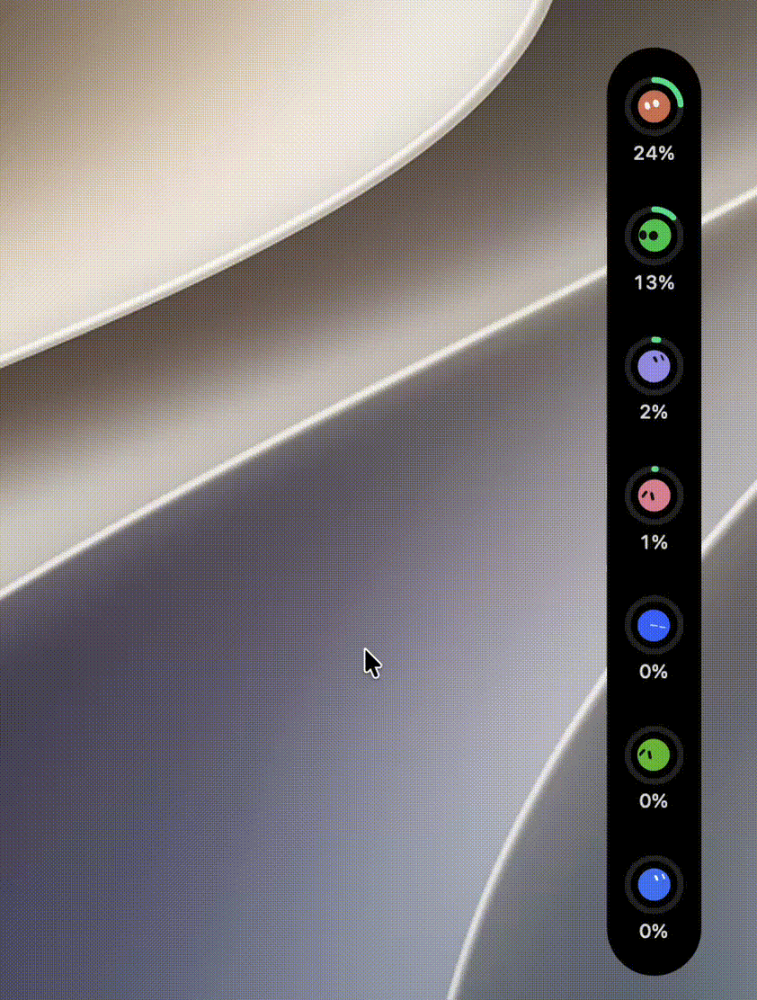

# Rings and surface

## Liquid Glass

Optional, **off by default** (`AppSettings.panelAppearance == .glass`, `PanelSurface`). Dark (flat black) stays the default because a solid rail is legible over anything.

`AppSettings.panelAppearance` is **dark / light / system / glass** — one setting. Glass used to be a separate toggle that silently overrode Light. Light exists because a black bar parked on a page of work all day is a hole in the page — not pure white (that vanishes on a white page, and the panel has no window shadow), a hairline on the light fill is the edge. Auto follows the Mac. Glass takes its cue from what is behind it.

- Do **not** scrim the glass. `Glass.tint` is a hue, not a darkening. Content uses `.primary`, not hardcoded white. Pin the chosen scheme **only** when glass is off, via `.environment(\.colorScheme, …)` — not `preferredColorScheme` (window-wide).
- Do **not** take the surface out of hit testing. `allowsHitTesting(false)` is what stopped gap-dragging. The window takes the drag in `sendEvent` before any view sees the event. [input.md](input.md)
- Use `Glass.clear`, not `.regular`. `.regular` was measured (historical) as opaque milky white in a transparent panel. Needs macOS 26; `#available` with a vibrant blur behind it.

**Historical diagnosis is uncertain.** An older note blamed macOS 26 glass for swallowing input outside SwiftUI’s hit-testing chain (rings-only drag; forums thread 816366). The same symptom then appeared on the black panel once the berth stopped claiming presses. Current code claims the surface and takes events in `sendEvent`. **Do not claim real-input verification** for glass or black. Settings still add “Drag it by a ring while this is on.” when glass is enabled — that caption is current UI, not proof of the old diagnosis.

[../decisions/liquid-glass.md](../decisions/liquid-glass.md)

## Colour and spent

Colour means **usage**, not identity. One setting owns the whole colour language: `AppSettings.ringColourScheme` (`RingColourScheme`, default Red alert). 1.2.1's spent-only picker (Emphasize / Follow usage / Quiet) only overrode the spent hue, so Quiet still went red at 98% used through the green→amber→red ladder. The scheme is the vocabulary; a global threshold plus a spent-only tweak is not. `Provider` carries no accent; the icon is the brand. Brand-coloured rings read as a warning (Claude’s orange at 3% used).

Three schemes, one value on the environment (`ringColourScheme`) so every ring, bar and figure agrees. `UsageTint.color(for:isExhausted:warningAt:scheme:)` and `UsageWindow.tint(warningAt:scheme:)` take both with **no default** — a default is how one ring comes to disagree with the one beside it.

- **Red alert** — the default, and the **only** scheme that may draw red. Green below `warningThreshold`, red at or above it, spent deep red (`pulseExhausted`). No amber step. `Turn red at` (`WarningThreshold`, 60–90%, default 75) is nested under this scheme only. It reaches the panel through `EnvironmentValues.usageWarningThreshold`, set once in `FloatingUsagePanelView`.
- **Gradient** — green → yellow/amber → deeper amber/orange by usage. `warningThreshold` is the yellow→orange step internally and is never shown as a red control. **Never red**, including when spent, exhausted, or locked.
- **Quiet** — a neutral grey scale by usage (fuller = darker, still readable on the dark rail). **Never red, never amber.** No nested red controls.

`warningThreshold` is not a layout input, so it does not belong in `PanelMetrics`. Every offered figure sits above `UsageTint.cautionThreshold` (0.5), which is Gradient's green→yellow step.

Per-account `RingTint` is opt-in. Under Red alert, spent red still wins over a chosen tint (`UsageRingView.isSpent` from the **provider**, not from the fraction — a lock can happen well short of 100%). Under Gradient and Quiet the scheme wins over alarm red; a chosen tint is kept, including when spent. System colour well, stored as hex, converted through **sRGB**. No opacity (translucent reads as “no reading”).

Countdown (`showsRemaining`): arc follows the figure; colour still means closeness to the limit. No reading → empty track either way; spent fills the ring. Do not invert `nil` to a full “100% left” circle. [../refresh-and-data.md](../refresh-and-data.md)

## Hover halo

The pointed-at halo hangs on the **progress arc**, not the ring view. Its inward half is **masked**, not covered with a disc. A `.shadow` on the composed view draws behind the icon (antialiased edges leak tint). An opaque disc is invisible on black and a white coin on glass. A mask has no colour to get wrong.

## Window-clock arc

`showsWindowClock`, default off. **Outside** the usage ring (inside is the activity mark). Neutral, low opacity, not a second hue. Applied as an overlay **after** `.frame(width: diameter…)`, never a ZStack child (a wider child grew the usage ring). Nil when the provider gives `resetsAt` or length without the other; `reportsLength` must be true. Own 60s ticker, not the usage loop.

## Second ring

`showsSecondRing`, default off. `ProviderUsage.secondWindow(preferring:)` — **the fullest limit in the ring's own model group**, falling back to the fullest of everything else when that group holds nothing more. Nil where the provider reports one limit: an empty second ring reads as a limit at zero, or as a fault.

**The group comes first because a provider can report two independent budgets.** Antigravity reports four windows — a five-hour and a weekly for `Gemini`, the same pair for `Claude and GPT` — and they are separate pools. Pairing the ring's Gemini weekly with a Claude five-hour puts two unrelated budgets on one mark, with nothing to tell the reader they have been mixed. Same group, and the two rings answer one question: how much of *this* pool is gone, over five hours and over the week.

Claude Code falls out of the same rule: its five-hour and weekly limits are unscoped, so they are each other's group, and the model-scoped weekly is left to the card. Stated as "fullest" rather than "the weekly one" so it needs no table of which window each provider calls its long one, and so it keeps working when the ring is pinned. `max(by:)` keeps the first of equals, so a rail of untouched windows stays in the provider's own order instead of shuffling between passes.

**Inside, not outside.** Outside is the clock arc's, and the limit that matters most has to stay the outer, bigger, thicker one — so nothing moves for anybody who leaves this off. Same colour language as the first ring: two arcs measuring the same kind of thing must be read the same way, and a second hue would be a second vocabulary for one idea. Size and weight are what tell them apart. Spent fills it, whichever way it counts.

**It moves what is already in there**, which is why the geometry lives in `DockLayout.secondRing…` rather than as a constant in the view. It is deliberately **not** a `PanelMetrics` entry: nothing outside the ring changes size, so a copy of the flag in the metrics was written on every change and read by nothing. At standard scale the band between the icon disc and the ring's inner edge is 6pt, and the **activity mark rides the middle of it** — the one place a second arc wants, and the providers reporting two limits are exactly the two whose CLIs make it spin. With the ring on, the mark moves in against the disc and the disc gives up 2pt a side. The ring, the rail's width and the ring centres are unchanged.

The percent label under the ring still follows the **outer** limit only. Two figures in that space is a change to `DockLayout.percentTextWidth`, which is a budget the whole rail is measured from.

## One ring per model group

`AppSettings.splitAccounts`, default off, per account, and offered only where `Provider.splitsByModelGroup` is true — Antigravity alone. Its plan carries a Gemini allowance and a separate one for Claude and GPT, reported as two `scope`s of one login. They are independent budgets, so a single ring can only show the busier one and silently drop the other.

**The rail is slots, not accounts.** `RailSlot.rail(for:isSplit:groups:)` is the one place that order is decided, and both the panel's `entries` and `PanelHitArea.slot(at:)` go through it. They have to agree: a ring drawn at one position and refreshed from another is a fault nobody reports clearly. Each slot carries its account plus an optional group; `id` is `account@group`, so SwiftUI keeps the two rings apart.

**Two rules keep a limit from disappearing into the split, and both prefer one ring to a lost window.** `modelGroups(of:)` is all-or-nothing: a reading that mixes scoped and unscoped windows yields no groups, because splitting it would file every window under a scope and leave the unscoped ones belonging to no ring. And more groups than `modelGroupCount` leaves the account whole rather than taking the first two — the rail is budgeted for that many and a third would be drawn past its end, but truncating loses the third group's limits entirely. One ring showing the busiest of three is worse than two rings; it is not worse than a limit nobody can see.

**A split account keeps its single slot until a reading actually carries more than one group.** Before the first answer there is nothing to split by, and one ring that becomes two a second later beats two empty ones that may never fill. Groups come back in the provider's own reported order, not sorted — that order is what Antigravity's own screen shows.

Both rings are the same account: same icon, same tint, same key, same refresh. Clicking either refreshes the login, because one reading feeds both. What differs is the windows — `windows.filter { $0.scope == group }` — and the title, which appends the group so VoiceOver and the card do not read out the same thing twice.

**The budget moves with it.** `AppSettings.railSlotCount` counts a split account as `provider.modelGroupCount` (a fixed 2, not the groups a reading happens to carry, so the rail does not resize when a provider answers one group short) and feeds `PanelMetrics.makeRoom(for:)`. Off by default for the same reason: a second ring costs a slot, and the rail is the whole of the panel when docked.

## What may not be animated

The rail's `railTop` / `railLeading` offsets track a pointer, so they must sit **outside** `.animation(_:value:)`. That modifier animates everything animatable in its subtree whenever its value changes — and with the offsets inside the card's `value: selectedSlot` spring, the first frame of a drag closed the card, which sprang the rail's *position* too: the panel visibly slid away from the hand carrying it. The card's own reveal still animates; the offsets are applied after it, outside.

## Activity mark

White arc on the empty ring between icon disc and usage stroke — **or just outside the icon disc when the second ring is on**, see above. Core Animation, not `TimelineView`. Reset `spinning` on disappear. **Not drawn at all while animated marks are on** — see below. [../refresh-and-data.md](../refresh-and-data.md)

## Animated marks

  

`AppSettings.botMarks`, **per account**, default off, switched on in that account's provider pane. It rides `RailEntry.showsBotMark` into the ring exactly as the chosen tint does — not the environment, because it is no longer one fact the whole rail shares. A logo says which of eighteen products a ring is; a mark gives that up for motion, which is worth it on the two or three rings somebody watches work and not on the rest.

**It takes the activity mark with it, on that ring only.** A white travelling arc and a mark that visibly gets to work are one fact drawn twice on a 36pt ring; where the mark is on, `isBusy` draws the bot's `working` state and no arc. Rings still showing a logo keep the arc.

**Eight personas** (`BotMarkPersona`). A persona is a set of motion scales (`tempo`, `motionScale`, `gazeScale`, `eyeScale` — all upstream config fields) and a choice of which upstream state each mood plays. Colour tells two rings apart at a glance; a different rhythm tells them apart while you watch. **A persona does not touch the body**: tying the two would mean picking "sleepy" to get a bean. **A persona changes how a mood is said, never what it says** — `spent` is `sad` for one and `bored` or `drowsy` for another, all of which mean the limit is finished; none of them may play `working` for a provider that is idle. `BotMarkTests` asserts that per mood against a list of allowed states, because this is the one way the feature could start lying. **The body is the reader's, and round by default** (`BotMarkBody`, `AppSettings.botShapes`, absent = `blob`). All eighteen upstream shapes are offered per account; every one is asserted to exist in the bundled table, because a picker row that draws nothing is worse than no row. Shapes are deliberately **not** dealt the way colours and personas are: those are dealt because two identical rings are unreadable and neither a colour nor a rhythm claims anything by itself, whereas a silhouette nobody chose would have the app saying something about that provider.

Automatic, which is the default, deals personas **by position on the rail** so the ring beside this one is a different character; eight cover eight rings before anything repeats. A per-account choice in the provider pane (`AppSettings.botPersonas`, absent = automatic) wins over the deal, for somebody who wants a particular provider to be the sleepy one. A stored persona that no longer parses reads as automatic.

**Work is a playlist, not a state** (`BotMarkProgramme`, `BotMarkPersona.workingStates`). Held in one upstream state, a working mark loops every second and a half for as long as the turn lasts and reads as a screensaver; three of them in a random order, 2.5–4.5s each, reads as a character busy with different things. The states are the ones that *mean* work — `working`, `spawning` (gather), `writing` (pencil), `searching`, `excited`, `thinking` — mixed differently per persona. The engine steps the playlist because it owns the clock, and because every change rebuilds that state's own table (expression pool, cadences, the morph it carries) which a view redrawing at 30fps cannot time. Two of those states are morphs: they shrink the character to a fifth and show the effect instead, which is the upstream's own design and is why the motion tests skip morph frames.

**`angry` joins the playlist out of hours and only then** (`BotMarkHours`, 09:00–21:00 weekdays). A turn at eleven at night is still work, done by somebody who would rather not be. The hours are a guess — no calendar is in this app — kept in one file so they are one line to change, and deliberately outside the mood table so they cannot leak into anything that claims to be a reading.

**The eyes follow the real pointer.** The panel already tracks it — `PanelPointerWatcher` samples a position rather than taking enter/exit events, because `.onHover` does not work on this window ([input.md](input.md)) — so the position is handed down the rail and each mark measures where that is relative to *itself* through a `GeometryReader` in the panel's named coordinate space. Divided by four radii rather than one, so the ring under the cursor looks hardest and its neighbours look part of the way: the whole rail swinging to full deflection reads as a stunt. Nil, when the pointer leaves the panel, puts every mark back on its own wandering gaze.

**The ring being pointed at listens.** `listening` while it is idle, and only while idle — a mark that is working carries on working while you look at it, and a spent one does not cheer up because the pointer arrived.

**A quiet rail gets bored, and sleepy about it at night.** Twenty minutes with nothing written by any CLI (`AgentActivityMonitor.lastWrite`, where **nil is not quiet** — it is nil until the first scan lands and for anyone with no transcripts at all) adds `bored` to an idle mark's playlist, or `drowsy` out of hours. The persona's own resting state stays first in the list, so a bored mark comes back to itself; the list is deduplicated because the sleepy character already rests *at* `bored`.

**Two one-shots** (`BotMarkEvent`), both of them facts Pulse witnessed rather than a view noticing its own history. A limit that turned over plays the full 6.4s `celebrate` — nine turns and a shower of ribbons — off `ResetWatch`, which runs the *same* `UsageWindow.hasTurnedOver(since:)` predicate the reset notification uses and is independent of whether notifications are on. A turn that just ended plays 2.6s of `excited`, off `AgentActivityMonitor.finishedAt`, which is the one place that sees a turn stop — and which now **fences a scan that outlived the monitor**: `stop()` clears `running` without recording a finish, but an in-flight scan used to write its stale set back afterwards, leaving a provider marked running with no timer to clear it and reporting a finish on the next launch for a turn nobody saw end. An event interrupts the playlist, plays once, and is not replayed while its fact stays true. A reset outranks a finish when both land together.

**Five moods, and no sixth** (`BotMarkMood`), resolved from the facts the ring already holds: busy → the working playlist, refreshing → `searching`, spent → `sad`, no reading → `sleeping`, else `idle`. Busy outranks the rest — a spent limit will still be spent in a minute, a CLI turning is happening now. **Nothing here reads the warning threshold**: how close a limit is, is what the ring's colour means, and saying it a second way on the same mark is how a rail stops being readable at a glance. `working` rather than the upstream's `thinking` because thinking is a morph that replaces the body with three dots, throwing away the face and the brand colour — the two things saying *which* provider is busy.

**Size is not the icon's.** `botScale` 1.4 against `iconScale` 0.8 — and it is measured against the **ring's inner edge**, not the disc: the canvas takes the full 28pt inside a standard 36pt ring, putting the body at about 25pt with 1.6pt of clearance from the stroke. Two things make a mark read smaller than the glyph it replaced: it draws into a 259-unit viewBox around a 229-unit body, so an eleventh of its canvas is margin the character moves inside (bob, lean, squash), and a face needs room for two eyes to be two eyes where a flat glyph does not. Wider than the 20pt disc behind it on purpose — that disc is near-black on a near-black rail and reads as a shadow, while the ring is the edge a reader sees, and the band the activity mark used to ride is free on a ring drawing a mark. It still scales *with* the disc, so the 2pt a side the disc gives up to the second ring takes the mark with it and the two cannot meet. There is little headroom left: bigger than this and the ring's own stroke or its 4pt gap has to give, both of which are layout budgets.

**Colour is identity, not status.** `BotMarkTint.brand` is the provider's own colour where it has one, lifted toward white below a luminance floor of 0.42 — several brands are black by design and would be a hole in the disc — with the eyes flipping to keep contrast against whatever the body became. Ten of eighteen providers are monochrome by design and have no brand colour at all; those are **dealt** one by `BotMarkTint.deal(over:)`, which is handed the rail's providers **in the order they are drawn** — the dock does it, because the rail shows enabled accounts and who sits next to whom is not knowable from `Provider.allCases`. The wheel is ten hues 36° apart, each levelled to the same luminance (at one fixed lightness a yellow glares and a blue reads as black). A rail is dealt by walking that wheel with a stride coprime to ten, so no colour repeats; the stride and the starting slot are the only freedom, there are forty of those, and all forty are tried — the winner is the one whose closest *neighbouring* pair is furthest apart. Two brand colours side by side are not scored: MiniMax's two rows really are one red.

Four schemes failed before this one, each in a way the next only half fixed: ten hand-picked hexes put two greens 49° apart, two blues 14° and two ambers 13°; a hash of the provider id collided outright, three ids on one colour and three on another; dealing a fixed palette in declaration order sat a dealt amber next to Claude Code's clay; and greedy choice ran out of colours near the end of a long rail, where it then had no option but to put two blues together. Placing hues only in the gaps the brands leave is worse than all of them — brands hold the blue and red ends, so avoiding them crowds all ten into yellow-green-to-purple at 24° apart, which is *more* near-identical greens. **A colour can be chosen per account** (`AppSettings.botColours`, absent = automatic), in the same Automatic/Custom shape the ring colour uses — and separate from it, because the ring means how close the limit is and the mark means which provider this is. A chosen colour is fixed: it is drawn as picked, and the rings beside it are dealt *away from its hue* exactly as they are from a brand colour, so choosing one cannot create the pair of near-identical neighbours the deal exists to avoid. The luminance floor still applies, so a black bot on the near-black disc is lifted rather than lost.

Inserting a provider shifts the colours after it — nothing is stored against them, so that is only a different-looking rail after an update. This is the one place brand colour is allowed on the panel; the ring beside it still means only how close the limit is, and [liquid-glass.md](../decisions/liquid-glass.md)'s neighbour in `UsageTint` explains why that line exists.

**The gaze leans away from the screen edge** (`BotMarkGaze`): a rail docked right looks left, docked left looks right, and a top rail — which has screen on both sides — looks ahead. Added to the mark's own wandering gaze rather than replacing it, so it still glances about from a head that is turned. Seven units of the upstream's ±15 gaze range, which reads as a direction at 16pt and stays clear of the span clamp that would pin an eye against the inside of the body. Tested by reading the eye transforms with the autonomous gaze switched off, since a screenshot cannot tell a lean from a glance.

**Working has to be visible as working**, because a ring drawing a mark does not draw the activity arc. Three things carry it, and the first two were measured rather than guessed. Rotation was tried first and does not work: the rotation spring runs at 5 rad/s against a signal at 1.6Hz, so it is a low-pass filter — a 2.4× target took the swing from 1.1° only to 2.6°, and more tilts the body over instead of wobbling it. **Squash carries a pulse** (`squashScale`, ×3 for working): its spring runs at 10 and follows the same rhythm, measured 3.7% peak-to-peak height against idle's 1.3%. ×10 was tried and reported as the mark resizing itself — 20% of the body's height is five points at 25pt, which is a different thing from breathing — so the amplified target is **clamped to 0.9…1.12**. The clamp is not tuning, it is a guard: the multiplier scales whatever a state already does, and the states differ by an order of magnitude, so the same ×10 that made `working` visible collapsed an `excited` body to a fifth of its height and stretched it half again. **Tempo halves** (`tempoEmphasis`), so a working mark blinks and glances twice as often and takes its spin every 3–4.5s instead of 6–9. And the spin throws **ribbons** — measured on 158 of 720 frames over twelve seconds. Neither emphasis touches translation, which has nowhere to go; see the bound below.

Particles are **on at every size**, including 25pt. They were gated off below 48pt on the theory that confetti at ring size is a few stray pixels — the confetti is, but the orbit ribbons are not, and they are the one thing in this vocabulary that unmistakably reads as "doing something" that small. They cost nothing while a mark is not spinning, which is almost always.

**The drawn position is bounded to 12 units** of the viewBox's ~15 units of margin around the body. Found by measurement, not by looking: `drowsy` nods 25 units and a bounce gesture throws the body 48, both of which ran off the canvas and were clipped — the top of the head simply disappeared. Bounded at the drawn transform rather than at the spring targets, so the physics stay the upstream's; morph poses are left alone because an effect brings its own wider viewBox. Reduce-motion draws a settled still rather than a frozen first frame, so the mood is still legible — solved **outside** the draw closure and memoised by what it is of, because a still is three seconds of simulated animation and a draw happens every time the pointer moves. It waits out a blink by asking whether one is *in flight*, not by waiting for the eyelid to pass a threshold: a state's resting eyelid is not 1 (`drowsy` sits at 0.34 and never blinks at all), so the threshold version never finished for those states and, where it did, finished on the overshoot at the top of a blink. **30fps, not the display's rate** (`TimelineView(.periodic)`): everything the rail plays is slow enough that the difference is invisible at ring size, and it is measurably cheaper — settled, seven rings animated cost ~15% of a core against ~19% at display rate, over a ~10% baseline with none. `TimelineView` **does** tick on this panel — measured once on a real docked rail, three screen captures 0.45s apart all differing — which is the exception to the note above; it is one measurement on one machine, not a claim about every window state.

Geometry, its provenance and its rights position: [../decisions/bot-mark-geometry.md](../decisions/bot-mark-geometry.md). Regenerate with [`Scripts/extract-bot-data.py`](../../Scripts/extract-bot-data.py).

## Icons

`LobeIconView` is a template image with **no colour of its own**. Do not hardcode white there — settings sidebar needs the ordinary label colour.
