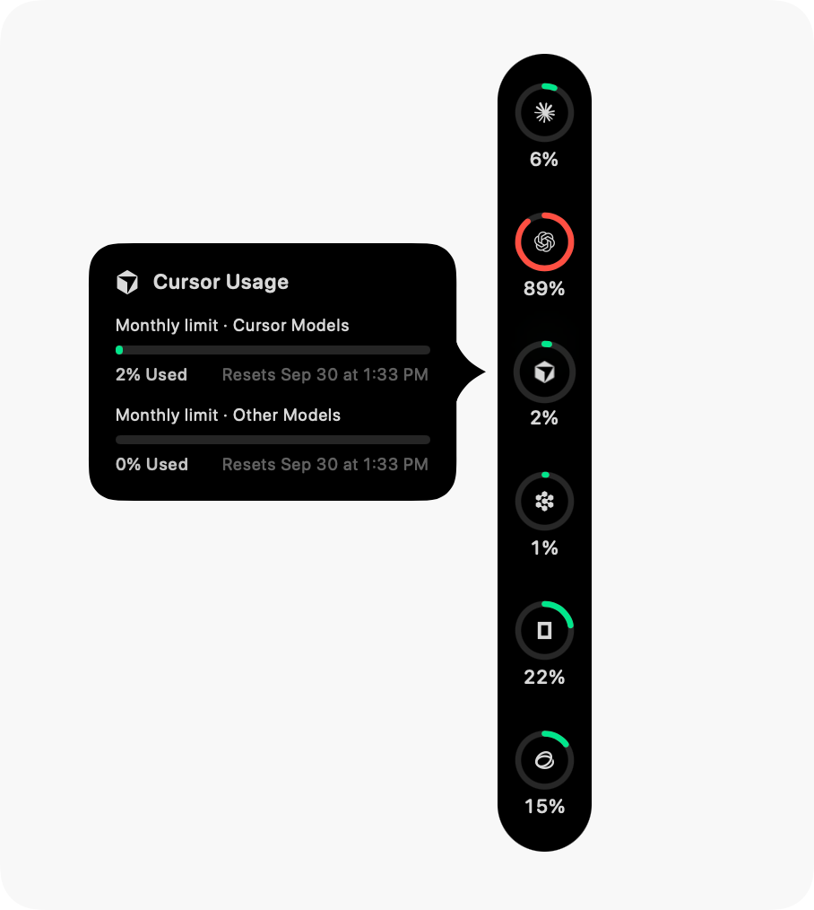
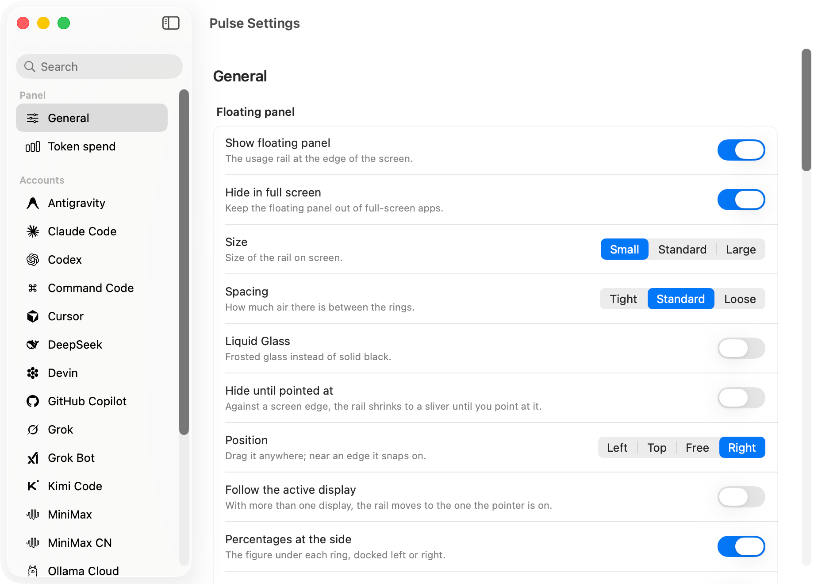
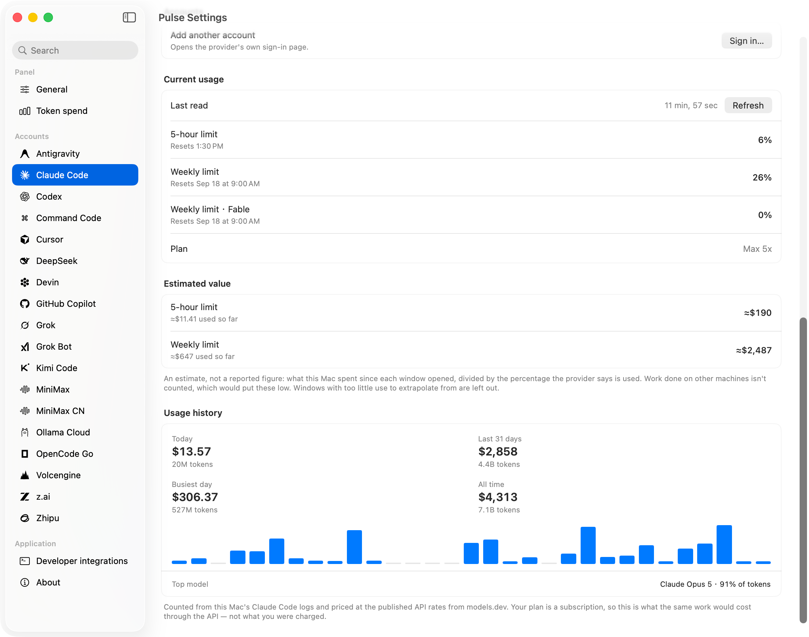
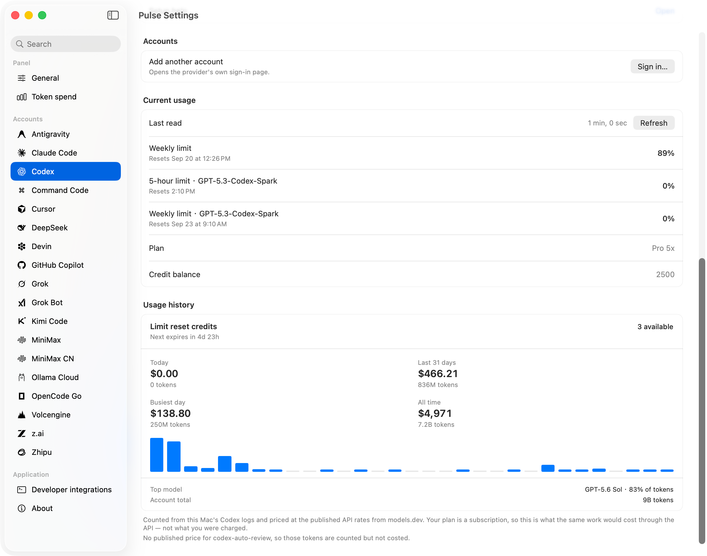
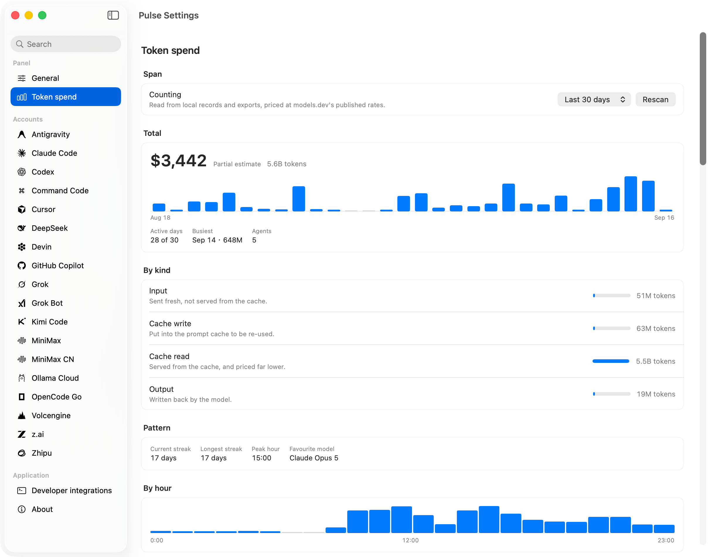
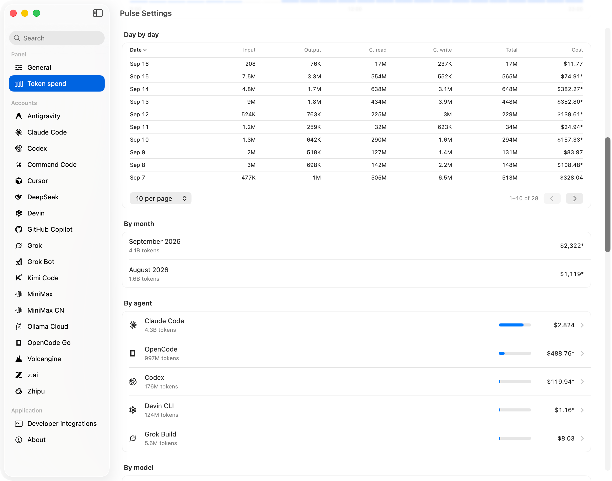
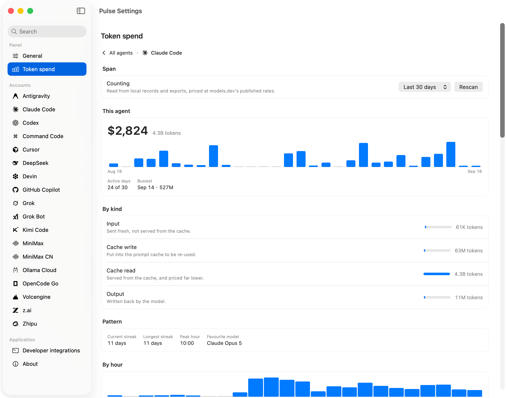
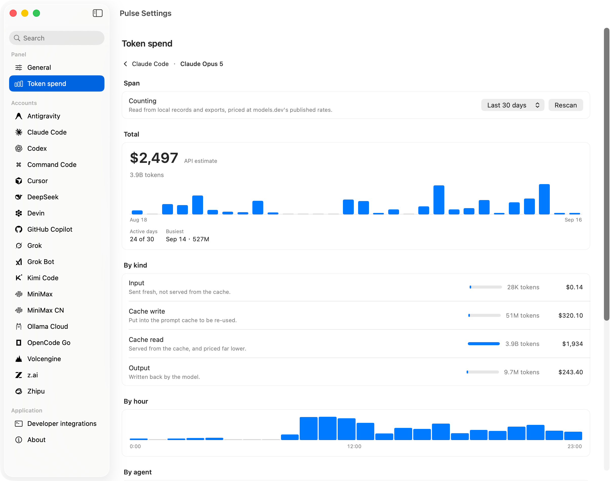

<p align="center">
  
</p>

<h1 align="center">Pulse</h1>

<p align="center">
  <b>輕巧優雅的 macOS 螢幕邊緣 AI 編碼額度監視器。</b><br>
  即時掌握 Claude Code、Codex、Cursor、GitHub Copilot、Antigravity、Grok 等多平台的額度與剩餘用量。
</p>

<p align="center">
  <a href="https://github.com/harrisliangsu/Pulse/releases/latest"></a>
  
  <a href="https://github.com/harrisliangsu/Pulse/actions/workflows/ci.yml"></a>
  
  <a href="LICENSE"></a>
</p>

<p align="center">
  <sub><b>macOS 14 Sonoma 或以上版本</b> · Apple 晶片與 Intel 通用 · <a href="README.md"><b>English</b></a> · <a href="README.zh-CN.md"><b>简体中文</b></a> · <b>繁體中文</b> · <a href="README.ja.md"><b>日本語</b></a> · <a href="README.ko.md"><b>한국어</b></a></sub>
</p>

<p align="center">
  
</p>

Pulse 是一個停靠在螢幕邊緣的小巧懸浮監視器。它顯示各服務自己回報的剩餘額度——走的是該產品自己的用戶端通道，而不是 Pulse 的伺服器——沒有 Pulse 帳號、沒有遙測。Pulse 不會自行編造用量百分比。

---

## 核心特色

### 一目了然的用量圓環
- **智慧用量著色**：圓環隨使用率平滑變色（綠 → 琥珀 → 紅 → 用盡深紅），也可依帳號自訂專屬強調色。
- **即時工作狀態指示**：圓環邊緣帶有緩慢旋轉的光點，即時顯示 Agent 是否正在產生回應（支援 Claude Code 與 Codex）。
- **時間視窗進度弧**：可選的外層時鐘副弧線，呈現目前額度視窗已經過的時間比例。
- **倒數／正數自由切換**：可在「已消耗百分比（`75% used`）」與「剩餘額度（`25% left`）」之間一鍵切換。

### 懸停詳情卡與智慧預測
- **完整額度明細**：將指標移到任一圓環上，即會展開詳情卡，列出所有回報的額度池、重設倒數與目前視窗狀態。
- **消耗速率與耗盡預測**：自動推估目前的使用節奏能否撐過本輪額度視窗；偵測到風險時，顯示預估耗盡時間（ETA）。
- **釘選主要視窗**：可把最在意的額度釘在圓環上，或讓 Pulse 自動追蹤最接近用盡的那一條。

### 原生流暢、安靜不打擾
- **多位置隨心停靠**：可停靠於螢幕左緣、右緣或頂部（選單列之上），也可自由懸浮於任何位置。
- **多螢幕原生支援**：可將 Pulse 拖到任何外接螢幕；它會記住螢幕位置，螢幕中斷時也能優雅返回。開啟**跟隨作用中螢幕**後，唯一的那條膠囊會自動移動到指標所在的螢幕。
- **自動收起**：閒置時自動收成極細的一線，消除干擾；只有在額度嚴重不足時，才泛紅發光。
- **可選的系統通知**：預設全部關閉，直到你開啟。額度越過 75/80/90/95%、服務商回報用盡、先前提醒過的視窗重新恢復、連續多次檢查失敗（面板正悄悄顯示較舊的數字），以及預付額度跌破你設定的金額時，都會收到通知。每件事只說一次：開啟此功能時已經越線的額度會立刻告知一次，之後不再重複，直到它重設或變得更糟。
- **全螢幕空間相容**：預設不會出現在其他全螢幕應用的 Spaces 中。
- **macOS 質感**：經典沉穩的純黑底板，或在 macOS 26+ 上使用原生 **Liquid Glass**。

### 多帳號與本機帳本
- **多帳號支援**：可同時監看同一服務的多個訂閱（Claude Code、Codex、Grok、Grok Bot），並排顯示並自訂標籤。
- **消費歷史**：從本機記錄、資料庫與匯出檔重建你的 token 消費，並依官方公開 API 價格計價。預設顯示最近 7 天，記住你選擇的區間，並保留每個模型的 token 與估算金額。
- **十八個服務商**：Claude Code、Codex、Antigravity、Cursor、GitHub Copilot、Grok、Grok Bot、OpenCode Go、Kimi Code、Ollama Cloud、z.ai、Zhipu、MiniMax（國際與中國大陸）、Volcengine、Command Code、DeepSeek 與 Devin。
- **可腳本化**：`Pulse --json` 印出最近一次讀數——方案、每一條額度、重設時間，以及數字有多舊——可接 tmux、sketchybar、Raycast 或 shell 提示字元。它只讀快取、不發出請求，高頻輪詢也不花費任何成本。
- **開發者整合**：在設定中匯出 Raycast 擴充功能，以及可直接設定的 tmux、sketchybar 與 shell 指令碼。帳號連結會直接開啟對應頁面。[設定指南](Docs/integrations.md)。
- **連線診斷**：查看實際的讀取來源、快取使用情形、最近一次檢查與備援結果。情境化操作可協助重新連線、重新登入或修正憑證；可複製不含帳號資訊與金鑰的診斷報告。
- **隱私優先**：沒有 Pulse 伺服器、沒有 Pulse 帳號、沒有遙測。請求只會送到你原本就在使用的服務商（並遵循 macOS 系統代理設定）。

<p align="center">
  
  &nbsp;&nbsp;&nbsp;&nbsp;
  
</p>

<p align="center">
  
  &nbsp;&nbsp;
  
</p>

<p align="center">
  
  &nbsp;&nbsp;
  
</p>

<p align="center">
  
  &nbsp;&nbsp;
  
</p>

---

## 支援的服務商與資料通道

Pulse 只呈現各服務回報的數字，絕不從本機 token 數量推測百分比。各產品的通道不同（已文件化的用戶端 API、編輯器登入、本機 language server、貼上的金鑰）——並不是每一行都有公開的官方額度 API。貢獻者細節見 [Docs/providers/README.md](Docs/providers/README.md)。

| 服務商 | 資料通道與驗證方式 | 說明 |
|---|---|---|
| **Claude Code** | 帳號 OAuth 用量端點；自動備援至 Claude 桌面版工作階段與狀態列 | 讀取現有的 CLI／桌面版工作階段；無縫自動備援 |
| **Codex** | 用戶端用量端點；備援至 `codex app-server` | 直接讀取本機 Codex 憑證 |
| **Antigravity** | 本機 Language Server（LSP） | 僅在 Antigravity 編輯器執行期間有效 |
| **Cursor** | Cursor 帳號用量摘要 API | 以現有編輯器登入顯示 fast 與 slow 兩個請求池 |
| **Grok** | Grok Build CLI 代理（`cli-chat-proxy.grok.com`） | 所有 Grok 產品共用一個統一的每週額度池 |
| **Grok Bot** | Cursor 儀表板 API | Cursor 訂閱內含的 xAI 額度 |
| **GitHub Copilot** | GitHub Device Code 驗證 | 只請求最小的 `read:user` 權限；絕不存取你的儲存庫 |
| **OpenCode Go** | API 金鑰，或現有的 OpenCode CLI 憑證 | 可在設定中完整設定 |
| **Kimi Code** | 直接使用 API 金鑰 | 在設定中設定 |
| **z.ai** | 直接使用 API 金鑰 | 國際站（`api.z.ai`） |
| **Zhipu** | 直接使用 API 金鑰，或已儲存的 GLM 工具憑證 | 中國大陸站（`open.bigmodel.cn`） |
| **MiniMax / MiniMax CN** | 直接使用 API 金鑰 | 支援國際站（`minimax.io`）與中國大陸站（`minimaxi.com`） |
| **Ollama Cloud** | 瀏覽器工作階段 cookie | 從瀏覽器本機讀取。詳見 [Docs/ollama-cloud.md](Docs/ollama-cloud.md) |
| **Volcengine（火山引擎）** | `arkcli` 登入，否則使用貼上的 access-key 組（簽署 Top OpenAPI） | Ark Coding 與 Agent 方案；自動模式偏好貼上的金鑰而非 CLI |
| **Command Code** | 貼上的金鑰，否則使用 `cmd auth login` 已儲存的登入 | 以美元計價的額度餘額；每月方案列標示為**估算** |
| **DeepSeek** | 貼上的金鑰；官方文件化的 `GET /user/balance` | 僅有預付餘額、沒有額度；圓環要對照什麼由你決定 |
| **Devin** | 無需輸入——讀取你的瀏覽器工作階段，不會跳出鑰匙圈提示 | Devin 回報的每日與每週額度。沒有瀏覽器工作階段或貼上的憑證時，讀取應用程式存下的帶日期方案。端點失敗時只使用相符的端點快取，保留帳號與組織界線（[Docs/providers/devin.md](Docs/providers/devin.md)） |

---

## 安裝

1. 從 [Releases](https://github.com/harrisliangsu/Pulse/releases/latest) 下載最新的 **`Pulse-x.y.z.dmg`**。
2. 開啟磁碟映像，將 **Pulse** 拖進你的 `Applications` 資料夾。

> [!NOTE]
> **macOS 首次啟動的 Gatekeeper 攔截**：  
> Pulse 是開放原始碼專案，沒有 Apple 開發者憑證。首次啟動時 macOS 可能會阻擋：
> - **方式 1（圖形介面）**：啟動 Pulse，關閉警示，打開 **系統設定 → 隱私權與安全性**，點選 **仍要打開**。
> - **方式 2（終端機）**：
>   ```bash
>   xattr -cr /Applications/Pulse.app
>   ```
>   *（之後透過內建的 Sparkle 更新會順暢進行，不會反覆出現提示）*。

---

## 隱私與安全

Pulse 以嚴格的「本機優先」安全原則設計：
- **沒有 Pulse 後端**：沒有 Pulse 伺服器、帳號或遙測。應用程式直接與你已在使用的服務商溝通，不會插入自己的代理；macOS 系統代理設定仍然適用。
- **本機憑證**：在產品本身如此運作的前提下，讀取開發工具已存放在本機的憑證（`~/.claude`、`~/.codex`、Cursor 儲存空間等）；部分服務需要你在設定中輸入金鑰或登入。
- **加密的本機儲存**：手動輸入的 API 金鑰與工作階段權杖會加密，並嚴格存放於 Pulse 的本機應用程式目錄，權限僅限擁有者。
- **程式碼與對話隱私**：Pulse 絕不讀取你的原始碼、終端機歷史、prompt 或 LLM 對話。

---

## 從原始碼建置

Pulse 以原生 Swift 與 SwiftUI 建置，沒有沉重的外部相依。

```bash
# 複製儲存庫
git clone https://github.com/harrisliangsu/Pulse.git
cd Pulse

# 直接建置並執行
swift run Pulse

# 或打包成標準的 macOS App Bundle
./Scripts/bundle.sh
```

工具鏈設定請見 [Docs/build-from-source.md](Docs/build-from-source.md)。發佈流程：[Docs/releasing.md](Docs/releasing.md)。

---

## 參與貢獻

文件如何組織、哪些行為不能回退、如何更新正確的頁面：[CONTRIBUTING.md](CONTRIBUTING.md)。主題文件索引：[Docs/README.md](Docs/README.md)。

---

## 設計來源

Pulse 的靈感來自 [**Vinz**（@hivinz_）](https://x.com/hivinz_/status/2092996055248126353) 於 2026 年 8 月在 X 上分享的 UI 概念。Pulse 是獨立實作，互動、功能、動畫與視覺細節均為自有。Vinz 與 Pulse 沒有關聯，也不為其負責。

---

## 授權

本專案依 [Apache 2.0](LICENSE) 授權。內含的第三方資源保留其各自的授權條款；詳見 [THIRD_PARTY_NOTICES.md](THIRD_PARTY_NOTICES.md)。
